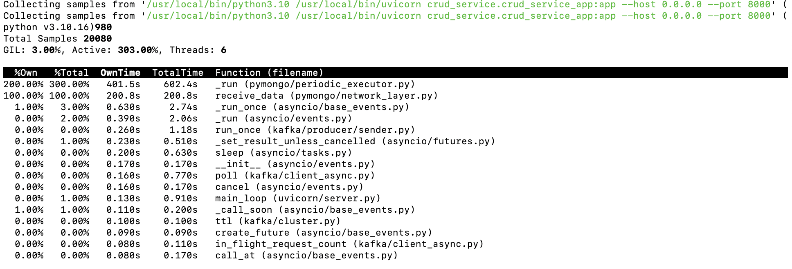

# IOT_gateway
Distributed IoT Gateway System with Edge ML for Distrubuted Systems 2025

 Quick Start Guide
=====================================

CONTENTS:
1. Prerequisites
2. Setup Instructions
3. Running the Server
4. Running the Client
5. Verifying Data in MongoDB
6. Troubleshooting

-----------------------------------------------------
1) PREREQUISITES
-----------------------------------------------------
- Python 3.11+ installed
- A local or remote MongoDB instance:
  - Local: Download & install MongoDB Community Edition
  - Remote: MongoDB Atlas account with a connection URI
- Installed Python dependencies (see requirements.txt):
  - grpcio, grpcio-tools, pymongo
- Installed Java (JDK)
- Installed Kafka
- Installed Docker (http://localhost:9090)
   - Installed/updated WSL 2 if needed (Windows)
- Installed Grafana (http://localhost:3000 )
- Install wait-for-it.sh in the current working directory for holding the other services until Kafka runs
- curl -O https://raw.githubusercontent.com/vishnubob/wait-for-it/master/wait-for-it.sh

-----------------------------------------------------
2) SETUP INSTRUCTIONS
-----------------------------------------------------
1. CLONE THE REPOSITORY
   git clone <REPO_URL>
   cd <PROJECT_FOLDER>

2. CREATE AND ACTIVATE A VIRTUAL ENVIRONMENT 
   python -m venv venv
   # Windows:
   venv\Scripts\activate
   # Mac/Linux:
   source venv/bin/activate

3. INSTALL REQUIRED DEPENDENCIES
   pip install -r requirements.txt

4. ENSURE MONGODB IS RUNNING
   - Local:
       - mongod
       - mongosh --host localhost --port 27017
   - MongoDB Atlas:
       Make sure your connection URI is correct in server.py

5. KAFKA INSTALLATION AND SETUP (macOS)
   - Install:
       brew install kafka
   - Start Kafka Service:
       - brew services start zookeeper
       - brew services start kafka
   - Verify Kafka Service is Running:
       kafka-topics --list --bootstrap-server localhost:9092
   - Install JDK:
       brew install openjdk
   - Install Confluent Kafka Python Package:
       pip install confluent-kafka

    KAFKA SETUP (Windows)
   - Start Zookeeper
      - In powershell: 
      cd C:\kafka_2.13-3.9.0
      .\bin\windows\zookeeper-server-start.bat .\config\zookeeper.properties
   - Start Kafka
      - In another powershell window:
      cd C:\kafka_2.13-3.9.0
      .\bin\windows\kafka-server-start.bat .\config\server.properties
   

6. CREATE KAFKA TOPIC
   kafka-topics --create --topic workflow-events --bootstrap-server localhost:9092 --partitions 1 --replication-factor 1

   CREATE KAFKA TOPIC (Windows)
   - in powershell:
   .\bin\windows\kafka-topics.bat --create --topic topic --bootstrap-server localhost:9092 --partitions 1 --replication-factor 1

-----------------------------------------------------
3) RUNNING THE SERVER
-----------------------------------------------------

LOCALLY:
1. Open a terminal in the project folder.
2. Start the gRPC server:
   python server.py
3. The server listens on port 50051 by default.
4. Start the Kafka Consumer to Listen to Events:
   python kafka_consumer.py
5. Metrics at http://127.0.0.1:8000/metrics

DOCKER:
in the terminal from the project directory
docker-compose down --volumes    # Stop and clean up
docker-compose build             # Rebuild the images
docker-compose up -d             # Start in detached mode
docker-compose logs -f           # Follow logs to ensure services are running

-----------------------------------------------------
4) RUNNING THE CLIENT
-----------------------------------------------------
1. Open another terminal (keep the server running).
2. Run the client to send synthetic sensor data:
   python client.py

   The client sends multiple data points to the gRPC server and kafka consumer,
   which in turn stores them in MongoDB.

-----------------------------------------------------
5) VERIFYING DATA IN MONGODB
-----------------------------------------------------
A) MONGODB COMPASS:
   1. Launch MongoDB Compass.
   2. Connect to your MongoDB instance (e.g., mongodb://localhost:27017).
   3. Find the "iot_db" database and "sensor_data" collection.
   4. Check for newly inserted documents containing fields:
      device_id, timestamp, temperature, humidity, etc.

B) MONGO SHELL (OPTIONAL):
   1. Run: mongo
   2. Switch to the database: 
        use iot_db
   3. Query the collection:
        db.sensor_data.find().pretty()

-----------------------------------------------------
6) TROUBLESHOOTING
-----------------------------------------------------
1. If you receive "Connection refused" or "Failed to connect to server":
   - Make sure your MongoDB instance is running (mongod).
   - Check the database URI in server.py for typos.

2. If "ModuleNotFoundError" for grpcio or pymongo:
   - Make sure you've installed dependencies with: pip install -r requirements.txt
   - Confirm you are in the correct Python virtual environment.

3. If data doesn't appear in Compass:
   - Refresh Compass or ensure you're looking at the correct database and collection.
   - Check the server logs for any errors during insertion.

4. For Kafka, we need to install Kafka-python-ng otherwise, it shows a module not found error.

## Profiling 

1. Installation 
   - pip install py-spy

   - mac user
   - brew install py-spy

   Ensure py-spy is Installed Inside the Container

   - docker exec -it <container_id> /bin/sh
   - which py-spy
   - pip install py-spy

   - docker ps  (to get the container id of curd_services container)

   - docker exec -it 45828d5937a5 py-spy top --pid 1

2. Attach py-spy to the container:

   - docker exec -it <container_name_or_id> py-spy top --pid 1
   - Replace <container_name_or_id> with the actual container name (e.g., crud_service).

3. To generate a flame graph for deeper analysis:

   - docker exec -it <container_name_or_id> py-spy record -o profile.svg --pid 1 ( optional)
   This will create an SVG file (profile.svg) showing a visual representation of where the CPU time is being spent.
   Open the profile.svg file in a browser to analyze the results.

   

## Load Testing
- pip install locust

- locust -f locustfile.py --host=http://localhost:8000

1. Check if Kubernetes is Running

If Minikube is not installed, install it:

- brew install minikube

Then, start Minikube:
- minikube start

- If you are using Docker Desktop’s Kubernetes instead of Minikube, check if it’s enabled:

- Open Docker Desktop → Settings → Kubernetes → Ensure it is enabled.
- Restart Docker Desktop if needed.

- kubectl apply -f zookeeper-pvc.yml

- minikube stop
- minikube start

- brew install kind

- kind delete cluster
- kind create cluster

- kubernetes module 6

- kubectl apply -f zookeeper-pvc.yml
- kubectl apply -f kafka-pvc.yml
- kubectl apply -f mongo-pvc.yml
- kubectl apply -f prometheus-pvc.yml
- kubectl apply -f grafana-pvc.yml

## Verify the PVCs
- kubectl get pvc

kubectl apply -f HPAforCRUDService.yml

<!-- kubectl apply -f gRPCClientDeployment.yml -->

kubectl get pods

## Test Horizontal Pod Autoscaler (HPA)
- kubectl get hpa

kubectl get svc crud-service

## Simulate Traffic
kubectl get hpa --watch
kubectl get pods -l app=crud-service --watch

## kubectl exec -it crud-service-87ff87764-hchsk -- curl http://crud-service:80/metrics

kubectl exec -it prometheus-669ffdb99b-xs7hc -- nslookup crud-service

kubectl get pods -n kube-system | grep metrics-server

Make the script executable:
chmod +x apply-all.sh

Run the script:
./apply-all.sh

Verify Deployment

kubectl get pods
kubectl get svc

Test Monitoring 
kubectl port-forward svc/prometheus 9090:9090
kubectl port-forward svc/grafana 3000:3000

grafana
admin
beano.1man

kubectl exec -it crud-service-87ff87764-4hsts -- curl http://localhost:8000/metrics

kubectl run -it --rm --image=curlimages/curl --restart=Never curl-pod -- sh
curl http://crud-service:8000/metrics

 kubectl exec -it crud-service-778c468598-crs9l -- curl http://localhost:8000/metrics

  kubectl exec -it prometheus-669ffdb99b-xs7hc -- nslookup crud-service

  kubectl exec -it crud-service-778c468598-crs9l -- curl http://crud-service:8000/metrics

## Module 5: Performance Optimization

## Prerequisites
- Docker installed.
- Kubernetes cluster ( Minikube and Kind).
- Python and pip installed for local development.

## Steps to Reproduce

- docker exec -it <crud-service-pod> py-spy top --pid 1
Set Up Monitoring and apply Prometheus and Grafana configurations:

- kubectl apply -f prometheus.yml
- kubectl apply -f grafana.yml
Forward Prometheus and Grafana ports:

kubectl port-forward svc/prometheus 9090:9090
kubectl port-forward svc/grafana 3000:3000
Access Prometheus at http://localhost:9090/targets and Grafana at http://localhost:3000.
## Run Load Testing :
- Install Locust:
   - pip install locust
   - locust -f locustfile.py --host=http://localhost:8000
   - Open the Locust web interface at http://localhost:8089 to configure and start the test.

## Module 6: Elasticity and Scalability

- Prerequisites
   - Kubernetes cluster (e.g., Minikube or Kind).
   - kubectl configured to interact with the cluster.
   - All Docker images pushed to a container registry (e.g., Docker Hub).
   - Steps to Reproduce
      - Apply Kubernetes Manifests :
      - Deploy all services using the provided YAML files:

         - kubectl apply -f ZookeeperDeployment.yml
         - kubectl apply -f CRUDServiceDeployment.yml
         - kubectl apply -f GrafanaDeployment.yml
         - kubectl apply -f MongoDBDeployment.yml
         - kubectl apply -f prometheus.yml
         - kubectl apply -f gRPCServiceDeployment.yml
         - kubectl apply -f KafkaConsumerDeployment.yml
         - kubectl apply -f KafkaDeployment.yml
         - kubectl apply -f HPAforCRUDService.yml

   - Verify Pods and Services :
      - kubectl get pods
   - Check service status:
      - kubectl get svc

   - Test Horizontal Pod Autoscaling (HPA) :
      Verify HPA configuration:
      - kubectl get hpa
      - kubectl describe hpa crud-service-hpa

   - Simulate traffic using Locust:

      - locust -f locustfile.py --host=http://<your-crud-service-ip>:8000
   Observe scaling behavior:

      - kubectl get pods -l app=crud-service --watch
   - Access Monitoring Tools :
   Forward Prometheus and Grafana ports:

      - kubectl port-forward svc/prometheus 9090:9090
      - kubectl port-forward svc/grafana 3000:3000
      - Access Prometheus at http://localhost:9090/targets and Grafana at http://localhost:3000.

   - Test Fault Tolerance :
      - kubectl delete pod -l app=crud-service
      - kubectl delete pod -l app=kafka
      - kubectl delete pod -l app=mongodb

   - Verify recovery:
      - kubectl get pods --watch

   - Optional: Test DNS Resolution :
   From the Prometheus pod:
      - kubectl exec -it <prometheus-pod> -- nslookup crud-service
   From any pod:
      - kubectl exec -it <any-pod> -- curl http://crud-service:8000/metrics

## Note: 
Ensure all Docker images are built and pushed to a registry before deploying:

- docker build -t <your-dockerhub-username>/iot_gateway-<service-name>:latest -f Dockerfile.<service-name> .
- docker push <your-dockerhub-username>/iot_gateway-<service-name>:latest

- If using Minikube, ensure the Metrics Server is installed for HPA:
   - minikube addons enable metrics-server

For 
# Step 1: Deploy all services
- kubectl exec -it prometheus-669ffdb99b-xs7hc -- nslookup crud-service

- kubectl get pods -n kube-system | grep metrics-server

## Make the script executable:
- chmod +x apply-all.sh
## Run the script:
- ./apply-all.sh

# Step 2: Verify deployment
- kubectl get pods
- kubectl get svc

# Step 3: Test HPA
- kubectl get hpa
- kubectl describe hpa crud-service-hpa

# Step 4: Access monitoring tools
- kubectl port-forward svc/prometheus 9090:9090
- kubectl port-forward svc/grafana 3000:3000

# Step 5: Run load testing
- locust -f locustfile.py --host=http://<your-crud-service-ip>:8000

# Step 6: Simulate failures
- kubectl delete pod -l app=crud-service
- kubectl delete pod -l app=kafka
- kubectl delete pod -l app=mongodb